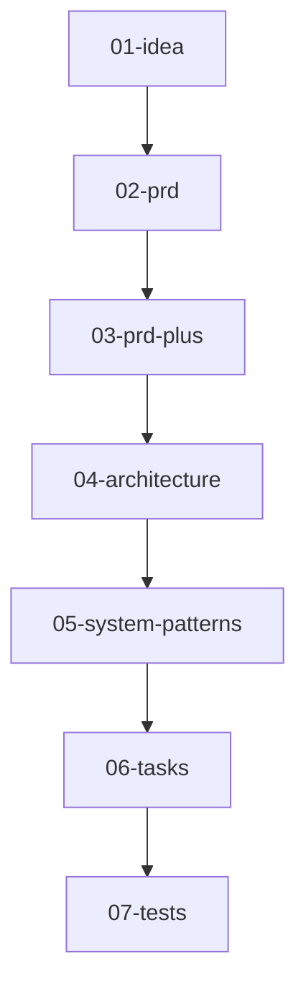

# AI SDLC — README

> **Version 0.3.0 (2025‑07‑21)** — Python 3.13 · `uv`‑first install · 7‑step lifecycle · Improved error handling & testing

---

## Overview

AI SDLC is a command-line tool that orchestrates a 7-step Software Development Lifecycle (SDLC) driven by Markdown files and powered by AI agents (specifically, the Cursor editor's agent mode). It helps structure the process from idea to test planning, using AI to generate content for each step based on the previous one. This approach aims to streamline development workflows, ensure comprehensive documentation, and leverage AI for common SDLC tasks.

---

## For Users: Getting Started with `aisdlc`

This section guides you on how to use the `aisdlc` CLI tool to manage the lifecycle of your software features.

### 1. Installation

Ensure you have Python 3.13 or newer.

```bash
# Install uv (a fast Python package installer and resolver) if you haven't already:
curl -LsSf https://astral.sh/uv/install | sh

# Create a Python 3.13+ virtual environment for your project:
# (Navigate to your project directory first)
uv venv --python 3.13

# Activate your virtual environment:
# On macOS/Linux:
source .venv/bin/activate
# On Windows (PowerShell):
# .\.venv\Scripts\Activate.ps1
# On Windows (CMD):
# .\.venv\Scripts\activate.bat

# Install ai-sdlc into your activated virtual environment:
uv pip install ai-sdlc
```

### 2. Initializing Your Project

Before you can use `aisdlc` for a project, you need to initialize it. This sets up the necessary configuration and directories.

```bash
# Navigate to your project's root directory:
# cd /path/to/your-project

# Initialize ai-sdlc for this project:
aisdlc init
```
This command will create:
*   `.aisdlc`: A TOML configuration file for the AI SDLC process.
*   `prompts/`: A directory containing prompt templates for each SDLC step.
*   `doing/`: A directory where active feature workstreams will reside.
*   `done/`: A directory where completed feature workstreams will be archived.
*   `rules/`: (Potentially) A directory for evolving architecture & pattern docs (generated in later steps).

### 3. Starting a New Feature Workstream

To begin working on a new feature or idea:

```bash
aisdlc new "My Awesome Feature Idea"
```
Replace `"My Awesome Feature Idea"` with a concise title for your feature. This command:
1.  Creates a unique slug (e.g., `my-awesome-feature-idea`).
2.  Creates a new directory: `doing/my-awesome-feature-idea/`.
3.  Creates the first file: `doing/my-awesome-feature-idea/01-idea-my-awesome-feature-idea.md`.
4.  Updates `.aisdlc.lock` to track this new workstream.

You should then open the `01-idea-*.md` file in your editor (like Cursor) and fill out the "Problem," "Solution," and "Rabbit Holes" sections.

### 4. Advancing Through the SDLC

Once you've completed a step's Markdown file (e.g., after filling out `01-idea-*.md`), you can advance to the next step:

```bash
aisdlc next
```
This command:
1.  Reads the current state from `.aisdlc.lock`.
2.  Identifies the previous step's Markdown file (e.g., `01-idea-*.md`).
3.  Identifies the prompt template for the *next* step (e.g., `prompts/02-prd-prompt.md`).
4.  Merges the content of the previous step's file into the prompt template.
5.  Invokes the Cursor agent with this merged prompt.
6.  Saves the AI-generated output to the new step's Markdown file (e.g., `doing/my-awesome-feature-idea/02-prd-my-awesome-feature-idea.md`).
7.  Updates `.aisdlc.lock` to the new current step.

You then review and edit the newly generated file, and repeat `aisdlc next` to proceed through all 7 steps.

### 5. Checking Status and Finishing

At any point, you can check the status of your active workstream:
```bash
aisdlc status
```
This will show the current feature slug, the current step, and a progress bar.

Once all 7 steps are completed and you are satisfied with the `07-tests-*.md` file:
```bash
aisdlc done
```
This command:
1.  Validates that all 7 Markdown files for the workstream exist.
2.  Moves the feature directory from `doing/` to `done/`.
3.  Clears the `.aisdlc.lock` file, making the system ready for a new workstream.

### CLI Command Reference

| Command                     | Purpose                                                                  |
| --------------------------- | ------------------------------------------------------------------------ |
| `aisdlc init`               | Scaffolds `.aisdlc`, `prompts/`, `doing/`, `done/` if missing.            |
| `aisdlc new "<idea title>"` | Creates a new workstream folder and the initial `01-idea-*.md` file.     |
| `aisdlc next`               | Reads lock ➜ picks next prompt ➜ calls Cursor ➜ writes file ➜ updates lock. |
| `aisdlc status`             | Shows the active workstream and its progress through the lifecycle steps.  |
| `aisdlc done`               | Validates all 7 files exist for the current workstream ➜ moves folder to `done/`. |

### The 7-Step Lifecycle

The AI SDLC process follows these ordered steps:

| Step | File suffix       | What you (and the AI) produce                                 |
| ---- | ----------------- | ------------------------------------------------------------- |
| 01   | `idea`            | Problem statement, solution sketch, potential rabbit holes.   |
| 02   | `prd`             | Core product requirements, user stories, acceptance criteria. |
| 03   | `prd-plus`        | Critical evaluation of PRD, risks, KPIs, UX considerations.   |
| 04   | `architecture`    | Analysis of current (if any) and proposed file structure, system patterns. |
| 05   | `system-patterns` | Canonical documentation for system architecture, design patterns, tech stack. |
| 06   | `tasks`           | Granular, actionable, ID-tagged development tasks.            |
| 07   | `tests`           | Unit, integration, and behavioral/E2E test plans and scenarios. |

*(Steps 08 & 09 for release planning/retro were removed in v0.2 – these are now expected to live in your preferred ticket tracker.)*

---

## For Developers: Contributing to `ai-sdlc`

This section is for those who want to contribute to the development of the `ai-sdlc` tool itself.

### 1. Prerequisites

| Tool                              | Why we chose it                                             | Install (macOS example)                                       |
| --------------------------------- | ----------------------------------------------------------- | ------------------------------------------------------------- |
| **uv**                            | Fast, deterministic builds, manages virtual-envs in-project | `curl -LsSf https://astral.sh/uv/install \| sh`               |
| **Python 3.13.0** (or newer)      | Modern language features (e.g., `tomllib`) & performance    | `uv venv --python=3.13` (or `pyenv install 3.13.0`)           |
| **Node ≥ 20 / pnpm** *(optional)* | If you plan to extend any TypeScript helpers (if present)   | `brew install node pnpm`                                      |
| **Cursor Editor**                 | Required for the `aisdlc next` command's agent functionality| Download from [cursor.sh](https://cursor.sh/)                 |

### 2. Development Setup

```bash
# Clone the repository:
git clone https://github.com/USERNAME/ai-sdlc.git # Replace USERNAME/ai-sdlc with the actual repo URL
cd ai-sdlc

# Create/activate Python 3.13+ virtual environment using uv:
uv venv # This will use the Python version specified in pyproject.toml or a globally available 3.13+
# Activate the environment:
# On macOS/Linux:
source .venv/bin/activate
# On Windows (PowerShell):
# .\.venv\Scripts\Activate.ps1

# Install dependencies, including development tools, from the lock file:
uv sync --all-features # Or uv sync --features dev if 'dev' is an optional feature

# Alternatively, if you've changed pyproject.toml and need to update the lock file:
# uv pip install -e .[dev] # Installs in editable mode with dev dependencies
# uv lock # Updates uv.lock based on pyproject.toml

# Set up pre-commit hooks (optional but recommended):
# uv pip install pre-commit
# pre-commit install
```

### 3. Running Linters and Tests

Ensure development dependencies are installed (via `uv sync --all-features` or `uv pip install -e .[dev]`).

```bash
# Run Ruff linter/formatter:
uv run ruff check ai_sdlc tests
uv run ruff format ai_sdlc tests

# Run Pyright type checker:
uv run pyright

# Run Pytest test suite:
uv run pytest
```
If TypeScript utilities are part of the project (e.g., in a `ts/` subdirectory), navigate to those packages and use `pnpm lint` / `pnpm test` as configured there.

### 4. Project Structure

*   `ai_sdlc/`: The main Python package for the CLI tool.
    *   `cli.py`: Entry point for the `aisdlc` command.
    *   `commands/`: Modules for each subcommand (e.g., `new.py`, `next.py`).
    *   `utils.py`: Shared helper functions.
*   `prompts/`: Contains Markdown templates used by the AI agent for each SDLC step. These are critical to the tool's behavior.
*   `tests/`: Contains unit and integration tests for the `ai-sdlc` tool.
*   `.aisdlc`: The TOML configuration file defining lifecycle steps, directory names, etc. This is scaffolded by `aisdlc init`.
*   `.aisdlc.lock`: A JSON file tracking the state of the currently active workstream (slug, current step). **Do not edit manually.**
*   `.cursor/rules/ai_sdlc.mdc`: Defines rules for how the Cursor AI agent should behave when interacting with this project.

### 5. Understanding the Core Logic

1.  The `aisdlc` command (from `cli.py`) parses the subcommand and arguments.
2.  It dynamically imports and calls the appropriate `run_*` function from the `ai_sdlc.commands` module.
3.  Commands typically:
    *   Load configuration from `.aisdlc` (via `utils.load_config()`).
    *   Read the current workstream state from `.aisdlc.lock` (via `utils.read_lock()`).
    *   Perform file system operations (creating/moving files and directories).
    *   For `aisdlc next`, it constructs a prompt by merging the previous step's output with a template from `prompts/` and calls the `cursor agent` via a subprocess.
    *   Update `.aisdlc.lock` (via `utils.write_lock()`).

### 6. Cursor Agent Interaction

The `aisdlc next` command is central to the AI-driven workflow.
*   It relies on the Cursor editor's "agent" mode being available in the system's PATH.
*   The file `.cursor/rules/ai_sdlc.mdc` provides high-level instructions to the Cursor agent on how to operate within an AI-SDLC workstream.
*   Each prompt template in `prompts/` (e.g., `02-prd-prompt.md`) contains a placeholder: `<prev_step></prev_step>`.
*   Before calling the agent, `aisdlc next` replaces this placeholder with the full Markdown content of the *previous* completed step. This provides context to the AI for generating the *current* step.

### 7. Contributing Guidelines

*   **Branching:** Create a new branch for each feature or bug fix (e.g., `feature/new-command`, `fix/readme-typo`).
*   **Commits:** Write clear and concise commit messages.
*   **Code Style:** Follow PEP 8 guidelines. Use Ruff for linting and formatting.
*   **Testing:** Add tests for any new functionality or bug fixes. Ensure all tests pass before submitting a pull request.
*   **Pull Requests:** Provide a clear description of the changes in your PR. If it addresses an issue, link to it.

---

## Lifecycle Mermaid (auto‑rendered from `.aisdlc`)

This diagram illustrates the flow of the 7-step lifecycle:


---

## Roadmap Ideas
*   [ ] Adding a step for deployment/infrastructure (CI/CD).
*   [ ] Think about repomix as part of the flow.
*   [ ] Add prompt for actually doing the tasks (should check against the token limit).
*   [ ] Preferred technologies for the project (Python, TypeScript, etc.).
*   [ ] More self improvement prompts for patterns in the codebase.
*   [ ] Re-evaluate incorporating a "08-release-plan" step for outlining deployment strategy, versioning, and communication.
*   [ ] Flexible AI Model Integration: Move away from hardcoding `cursor agent`. Allow users to specify their preferred AI model via a CLI flag (e.g., `--model gpt-4o`, `--model claude-3-opus`). This would involve users providing their own API keys (e.g., via environment variables configured in `.env` based on an updated `.env.example`), allowing separate model choices for planning/documentation steps vs. code generation steps.
*   [ ] Context Window Management: Implement strategies for managing large context windows, potentially drawing inspiration from tools like `aider` or `mentat`. This could involve techniques like summarization, embedding-based retrieval for relevant context, or more sophisticated context chunking when interacting with LLMs.

---

*Made with ☕ by Parker Rex & community. MIT License.*
