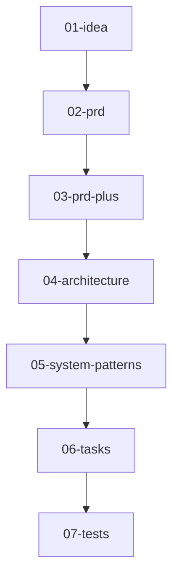

# AI SDLC — README

> **Version 0.2 (2025‑05‑17)**  — Python 3.13 + TypeScript support · `uv`‑first install · 7‑step lifecycle

---

## 0  Quick Start for *Coders*  🧑‍💻➡️📝

```bash
# 1 — install the tiny CLI into ANY fresh Python 3.13 venv
curl -LsSf https://astral.sh/uv/install | sh   # installs uv
uv venv                                        # creates .venv in repo root
uv pip install ai-sdlc                         # pulls the PyPI wheel

# 2 — bootstrap a new workspace
aisdlc init

# 3 — spin up your first idea (replace the title!)
aisdlc new "AI‑powered Doc Summaries"
# ➜ fills doing/ai-powered-doc-summaries/01-idea-*.md – edit it in your editor

# 4 — let the agent chain carry you through the SDLC
aisdlc next   # generates 02‑prd‑*.md from the idea
aisdlc next   # generates 03‑prd-plus‑*.md
…             # keep going until 07‑tests‑*.md shows green

# 5 — archive when all 7 steps are finished
aisdlc done   # moves folder to done/
```

*Nothing but Markdown files, Cursor AI, and this CLI.  No OpenAI key required – Cursor provides the model in “agent” mode.*

---

## 1  Developer Setup  💻  (macOS ≥ 12 Ventura)

| Tool                              | Why we chose it                                             | Install                                                                   |      |
| --------------------------------- | ----------------------------------------------------------- | ------------------------------------------------------------------------- | ---- |
| **uv**                            | Fast, deterministic builds, manages virtual‑envs in‑project | \`curl -LsSf [https://astral.sh/uv/install](https://astral.sh/uv/install) | sh\` |
| **Python 3.13.0**                 | walrus patterns, tomllib, & perf                            | `uv venv --python=3.13` (or `pyenv install 3.13.0`)                       |      |
| **Node ≥ 20 / pnpm** *(optional)* | if you plan to extend any TypeScript helpers                | `brew install node pnpm`                                                  |      |

```bash
# clone & install *editable* for local hacking
uv pip install -e .
# run the test suite (pytest + ts‑jest if TS code present)
pytest -q
```

### Directory Anatomy (after `aisdlc init`)

```
.aisdlc            # ⚙️ TOML manifest (steps, mermaid graph, etc.)
.aisdlc.lock       # 🔒 runtime state – DO NOT EDIT
prompts/           # 💬 system prompts for each lifecycle step
rules/             # 📚 evolving architecture & pattern docs (generated)
doing/             # 🚧 active workstreams (one dir per idea/feature)
done/              # ✅ completed workstreams (auto‑moved by `aisdlc done`)
```

### 7‑Step Lifecycle

| Step | File suffix       | What you produce                       |
| ---- | ----------------- | -------------------------------------- |
| 01   | `idea`            | Problem, solution sketch, rabbit holes |
| 02   | `prd`             | Core product requirements              |
| 03   | `prd-plus`        | Risks, KPIs, UX mocks, SLAs            |
| 04   | `architecture`    | Current ➜ future tree, diagrams        |
| 05   | `system-patterns` | Canonical design & coding rules        |
| 06   | `tasks`           | Granular, ID‑tagged tasks              |
| 07   | `tests`           | Unit, integration, E2E test plans      |

*(Steps 08 & 09 were removed in v0.2 – release planning / retro now live in your ticket tracker of choice.)*

---

## 2  CLI Reference  🔧

| Command                     | Purpose                                                                  |
| --------------------------- | ------------------------------------------------------------------------ |
| `aisdlc init`               | Scaffold `.aisdlc`, `prompts/`, and `rules/` if missing                  |
| `aisdlc new "<idea title>"` | Create `doing/<slug>/01‑idea‑<slug>.md`                                  |
| `aisdlc next`               | Reads lock ➜ picks next prompt ➜ calls Cursor ➜ writes file+updates lock |
| `aisdlc status`             | Show active workstream + progress bar                                    |
| `aisdlc done`               | Validate all 7 files exist ➜ move folder to `done/`                      |

---

## 3  Workstream Example  📂

```
doing/
└─ ai-powered-doc-summaries/
   ├─ 01-idea-ai-powered-doc-summaries.md
   ├─ 02-prd-ai-powered-doc-summaries.md
   ├─ 03-prd-plus-ai-powered-doc-summaries.md
   ├─ 04-architecture-ai-powered-doc-summaries.md
   ├─ 05-system-patterns-ai-powered-doc-summaries.md
   ├─ 06-tasks-ai-powered-doc-summaries.md
   └─ 07-tests-ai-powered-doc-summaries.md
```

---

## 4  Cursor Agent Behaviour (if you hack the prompts)  🧠

1. Load `.aisdlc` + all prompt files on every call.
2. If manifest missing ⇒ abort & tell user to run `aisdlc init`.
3. `aisdlc next` merges the previous step’s Markdown into the *next* prompt (placeholder `<prev_step>`).
4. The output **must** match the empty template for that step.
5. File is written, `.aisdlc.lock` advanced.

---

## 5  Lifecycle Mermaid (auto‑rendered from `.aisdlc`)



---

## 6  Contributing  🤝

* **Linting:** Ruff & Pyright – `uv pip install -e .[dev] && ruff check ai_sdlc && pyright`
* **Tests:** `pytest -q`
* **Commit hooks:** Provided via pre‑commit – `pre-commit install`
* **TypeScript utils:** run `pnpm lint` / `pnpm test` in `ts/` sub‑packages.

---

*Made with ☕ by Parker Rex & community.  MIT License.*
