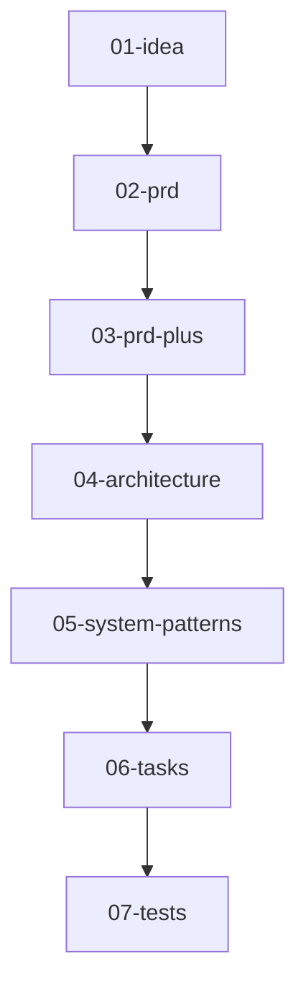

<h1 align="center">AI-SDLC CLI</h1>
<p align="center">Markdown-driven software-lifecycle powered by Cursor's agent</p>

<p align="center"><code>uv pip install ai-sdlc</code></p>


---

<details>
<summary><strong>Table of contents</strong></summary>

- [What is AI-SDLC?](#what-is-ai-sdlc)
- [Quick start](#quick-start)
- [How it works](#how-it-works)
- [Project layout](#project-layout)
- [Technology & dependencies](#technology--dependencies)
- [Running tests & static checks](#running-tests--static-checks)
- [Roadmap](#roadmap)
- [Contributing](#contributing)
- [License](#license)
</details>

---

## What is AI-SDLC?

AI-SDLC turns a **7-step product-to-test workflow** into simple markdown files that an AI agent fills in for you.
Think *chat-driven development* that stays under version control and never forgets a step.

---

## Quick start

```bash
# 1. install uv (fast resolver)
curl -LsSf https://astral.sh/uv/install | sh

# 2. create a local venv & install
uv venv && source .venv/bin/activate
uv pip install ai-sdlc          # installs the 'aisdlc' command

# 3. bootstrap a repo
aisdlc init                     # scaffolds .aisdlc, prompts/, doing/, done/

# 4. ship your first idea
aisdlc new "Refactor FastAPI auth"
# fill doing/<slug>/01-idea-*.md, then:
aisdlc next                     # repeat until step 7
aisdlc done                     # archives the completed feature
```

---

## How it works



Running `aisdlc next`:

1. Reads the previous markdown file
2. Merges it into the prompt for the next step
3. Calls **Cursor agent** (you need the Cursor editor installed)
4. Writes the new markdown and bumps `.aisdlc.lock`

---

## Project layout

```text
.
├── ai_sdlc/                # main Python package
│   ├── cli.py              # entry point for `aisdlc`
│   ├── commands/           # sub-commands: init | new | next | status | done
│   └── utils.py            # shared helpers
├── prompts/                # LLM templates for each SDLC step
├── tests/                  # pytest suite (unit + integration)
├── .aisdlc                 # TOML config (ordered steps, dirs, diagram)
├── pyproject.toml          # build + dependency metadata
└── README.md               # you are here
```

---

## Technology & dependencies

| Layer         | Main libs / tools | Why                                     |
| ------------- | ----------------- | --------------------------------------- |
| CLI           | **Python 3.13**, `click`-style argparse (stdlib) | modern syntax, zero deps runtime |
| Package mgmt  | **uv**            | fast, lock-file driven reproducibility |
| Dev tooling   | **Ruff**, **Pyright**, **pytest** | lint + format, type-check, tests |
| Agent call    | **Cursor editor** | local-first sandboxed agent execution |
| Packaging     | `setuptools`, PEP 621 metadata | slim install |

### `pyproject.toml` excerpt

```toml
[project]
name = "ai-sdlc"
requires-python = ">=3.13.0"

[project.optional-dependencies]
dev = [
  "pytest>=7.0",
  "pytest-mock>=3.0",
  "ruff>=0.0.292",
  "pyright>=1.1.350"
]
```

---

## Running tests & static checks

```bash
# install dev extras
uv pip install -e .[dev]

# lint + format
uv run ruff check ai_sdlc tests
uv run ruff format ai_sdlc tests

# type-check
uv run pyright

# run all tests
uv run pytest
```

Integration tests spin up a temp project dir and exercise the CLI flow.

---

## Roadmap

* [ ] **Pluggable AI providers** – flag `--model` to swap GPT-4o, Claude, Gemini, etc.
* [ ] **08-release-plan** step (CI/CD & deployment playbook).
* [ ] Context-window management (summaries / embeddings).
* [ ] Repomix bundle step for giant monorepos.
  See full ideas list at the bottom of the existing README for inspiration.

---

## Contributing

### Prerequisites

| Tool             | Install (macOS example)                                             |
| ---------------- | ------------------------------------------------------------------- |
| Python 3.13+     | `brew install python@3.13` or `pyenv install 3.13.0`                |
| **uv**           | `curl -LsSf https://astral.sh/uv/install | sh`                      |
| Cursor editor    | download from [https://cursor.sh/](https://cursor.sh/)              |
| Node 20 + pnpm*  | `brew install node pnpm` *(only if you touch TS helpers)*           |

### Dev setup

```bash
git clone https://github.com/your-org/ai-sdlc.git
cd ai-sdlc
uv venv && source .venv/bin/activate
uv sync --all-features        # installs runtime + dev deps from uv.lock
pre-commit install            # optional hooks
```

### Workflow

1. **branch** `feat/your-thing` → code → tests
2. `ruff check`, `pyright`, `pytest` must pass
3. Open PR, sign the lightweight CLA phrase:

   ```
   I have read the CLA Document and I hereby sign the CLA
   ```
4. A maintainer squash-merges after review.

---

## License

MIT © 2025 Parker Rex
See [LICENSE](LICENSE) for details.

---
