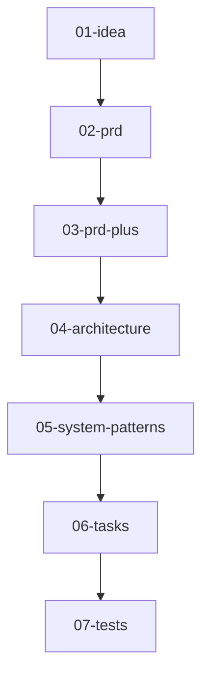

<h1 align="center">AI-SDLC CLI</h1>
<p align="center">Markdown-driven software-lifecycle powered by Cursor's agent</p>

<p align="center"><code>uv pip install ai-sdlc</code></p>


---

<details>
<summary><strong>Table of contents</strong></summary>

- [What is AI-SDLC?](#what-is-ai-sdlc)
- [Quick start](#quick-start)
- [Installation](#installation)
  - [Prerequisites](#prerequisites)
  - [Install AI-SDLC](#install-ai-sdlc)
- [Usage guide](#usage-guide)
  - [Basic workflow](#basic-workflow)
  - [Command reference](#command-reference)
- [How it works](#how-it-works)
- [Project structure](#project-structure)
- [Architecture](#architecture)
  - [Core Components](#core-components)
  - [Workflow Engine](#workflow-engine)
  - [Technology stack](#technology-stack)
  - [`pyproject.toml` excerpt](#pyprojecttoml-excerpt)
- [Development](#development)
  - [Prerequisites](#prerequisites-1)
  - [Setup](#setup)
  - [Testing \& static checks](#testing--static-checks)
- [Troubleshooting](#troubleshooting)
  - [Common Issues](#common-issues)
  - [Getting Help](#getting-help)
- [Roadmap](#roadmap)
  - [Planned Features](#planned-features)
  - [Future Considerations](#future-considerations)
- [Contributing](#contributing)
  - [Development Workflow](#development-workflow)
  - [Code Standards](#code-standards)
  - [Areas for Contribution](#areas-for-contribution)
- [License](#license)
</details>

---

## What is AI-SDLC?

AI-SDLC turns a **7-step product-to-test workflow** into simple markdown files that an AI agent fills in for you.
Think *chat-driven development* that stays under version control and never forgets a step.

---

## Quick start

```bash
# 1. install uv (fast resolver)
curl -LsSf https://astral.sh/uv/install | sh

# 2. create a local venv & install
uv venv && source .venv/bin/activate
uv pip install ai-sdlc          # installs the 'aisdlc' command

# 3. bootstrap a repo
aisdlc init                     # scaffolds .aisdlc, prompts/, doing/, done/

# 4. ship your first idea
aisdlc new "Refactor FastAPI auth"
# fill doing/<slug>/01-idea-*.md, then:
aisdlc next                     # repeat until step 7
aisdlc done                     # archives the completed feature
```

---

## Installation

### Prerequisites

| Tool          | Install (macOS example)                                |
| ------------- | ------------------------------------------------------ |
| Python 3.13+  | `brew install python@3.13` or `pyenv install 3.13.0`   |
| **uv**        | `curl -LsSf https://astral.sh/uv/install               | sh` |
| Cursor editor | download from [https://cursor.sh/](https://cursor.sh/) |

### Install AI-SDLC

```bash
# Option 1: Using uv (recommended)
uv pip install ai-sdlc

# Option 2: Using pip
pip install ai-sdlc

# Verify installation
aisdlc --help
```

---

## Usage guide

### Basic workflow

The AI-SDLC workflow follows a 7-step process from idea to tests:



**Step-by-step process:**

1. **Initialize project**: `aisdlc init`
2. **Start new feature**: `aisdlc new "Your feature idea"`
3. **Progress through steps**: `aisdlc next` (repeat for each step)
4. **Check status**: `aisdlc status`
5. **Complete feature**: `aisdlc done`

### Command reference

| Command             | Description                             | Example                                |
| ------------------- | --------------------------------------- | -------------------------------------- |
| `aisdlc init`       | Initialize AI-SDLC in current directory | `aisdlc init`                          |
| `aisdlc new <idea>` | Start new feature with idea description | `aisdlc new "Add user authentication"` |
| `aisdlc next`       | Progress to next step in workflow       | `aisdlc next`                          |
| `aisdlc status`     | Show current project status             | `aisdlc status`                        |
| `aisdlc done`       | Archive completed feature to done/      | `aisdlc done`                          |
| `aisdlc --help`     | Show help information                   | `aisdlc --help`                        |

**Working with steps:**
- Each step creates a markdown file in `doing/<feature-slug>/`
- Fill out the generated markdown before running `aisdlc next`
- The AI agent (Cursor) processes your input and generates the next step

---

## How it works


Running `aisdlc next`:

1. Reads the previous markdown file
2. Merges it into the prompt for the next step
3. Calls **Cursor agent** (you need the Cursor editor installed)
4. Writes the new markdown and bumps `.aisdlc.lock`

---

## Project structure

```text
.
├── ai_sdlc/                # main Python package
│   ├── cli.py              # entry point for `aisdlc`
│   ├── commands/           # sub-commands: init | new | next | status | done
│   ├── scaffold_template/  # default templates for new projects
│   └── utils.py            # shared helpers
├── prompts/                # LLM templates for each SDLC step
│   ├── 01-idea-prompt.md   # initial idea analysis
│   ├── 02-prd-prompt.md    # product requirements
│   ├── 03-prd-plus-prompt.md # enhanced requirements
│   ├── 04-architecture-prompt.md # system architecture
│   ├── 05-systems-patterns.md # design patterns
│   ├── 06-tasks-prompt.md  # implementation tasks
│   └── 07-tests.md         # test generation
├── tests/                  # pytest suite (unit + integration)
│   ├── unit/               # unit tests
│   └── integration/        # integration tests
├── doing/                  # active features (created by init)
├── done/                   # completed features (created by init)
├── .aisdlc                 # TOML config (ordered steps, dirs, diagram)
├── .aisdlc.lock           # current workflow state
├── pyproject.toml          # build + dependency metadata
├── CHANGELOG.md            # version history
└── README.md               # you are here
```

---

## Architecture

AI-SDLC is built around a simple but powerful concept: **markdown-driven development with AI assistance**.

### Core Components

1. **CLI Interface** (`ai_sdlc/cli.py`)
   - Entry point for all commands
   - Handles argument parsing and command routing

2. **Command System** (`ai_sdlc/commands/`)
   - Modular command structure
   - Each command handles a specific workflow step

3. **Prompt Templates** (`prompts/`)
   - LLM prompts for each SDLC step
   - Structured to guide AI through development process

4. **State Management**
   - `.aisdlc` - Project configuration
   - `.aisdlc.lock` - Current workflow state
   - File-based state tracking

### Workflow Engine

The workflow engine processes each step by:
1. Reading the previous step's output
2. Merging it with the appropriate prompt template
3. Calling Cursor agent to generate next step
4. Writing output and updating state

### Technology stack

| Layer        | Main libs / tools                                | Why                                    |
| ------------ | ------------------------------------------------ | -------------------------------------- |
| CLI          | **Python 3.13**, `click`-style argparse (stdlib) | modern syntax, zero deps runtime       |
| Package mgmt | **uv**                                           | fast, lock-file driven reproducibility |
| Dev tooling  | **Ruff**, **Pyright**, **pytest**                | lint + format, type-check, tests       |
| Agent call   | **Cursor editor**                                | local-first sandboxed agent execution  |
| Packaging    | `setuptools`, PEP 621 metadata                   | slim install                           |

### `pyproject.toml` excerpt

```toml
[project]
name = "ai-sdlc"
requires-python = ">=3.13.0"

[project.optional-dependencies]
dev = [
  "pytest>=7.0",
  "pytest-mock>=3.0",
  "ruff>=0.0.292",
  "pyright>=1.1.350"
]
```

---

## Development

### Prerequisites

| Tool            | Install (macOS example)                                   |
| --------------- | --------------------------------------------------------- |
| Python 3.13+    | `brew install python@3.13` or `pyenv install 3.13.0`      |
| **uv**          | `curl -LsSf https://astral.sh/uv/install                  | sh` |
| Cursor editor   | download from [https://cursor.sh/](https://cursor.sh/)    |
| Node 20 + pnpm* | `brew install node pnpm` *(only if you touch TS helpers)* |

### Setup

```bash
git clone https://github.com/your-org/ai-sdlc.git
cd ai-sdlc
uv venv && source .venv/bin/activate
uv sync --all-features        # installs runtime + dev deps from uv.lock
pre-commit install            # optional hooks
```

### Testing & static checks

```bash
# install dev extras
uv pip install -e .[dev]

# lint + format
uv run ruff check ai_sdlc tests
uv run ruff format ai_sdlc tests

# type-check
uv run pyright

# run all tests
uv run pytest

# run specific test types
uv run pytest tests/unit/      # unit tests only
uv run pytest tests/integration/  # integration tests only
```

Integration tests spin up a temp project dir and exercise the CLI flow.

---

## Troubleshooting

### Common Issues

**"cursor agent command not found"**
- Ensure Cursor editor is installed and the `cursor` command is in your PATH
- Try running `cursor --help` to verify installation

**"Permission denied" errors**
- Check file permissions in your project directory
- Ensure you have write access to the current directory

**"Invalid .aisdlc configuration"**
- Verify your `.aisdlc` file has valid TOML syntax
- Run `aisdlc init` to regenerate default configuration

**"Lock file corruption"**
- Delete `.aisdlc.lock` and run `aisdlc status` to regenerate
- The tool handles corrupted lock files gracefully

### Getting Help

1. Check the command help: `aisdlc --help` or `aisdlc <command> --help`
2. Review the [CHANGELOG.md](CHANGELOG.md) for recent changes
3. Open an issue on GitHub with:
   - Your OS and Python version
   - Full error message
   - Steps to reproduce

---

## Roadmap

### Planned Features

* [ ] **Pluggable AI providers** – flag `--model` to swap GPT-4o, Claude, Gemini, etc.
* [ ] **08-release-plan** step (CI/CD & deployment playbook)
* [ ] **Context-window management** (summaries / embeddings for large projects)
* [ ] **Repomix integration** for giant monorepos
* [ ] **Template customization** - custom prompt templates per project
* [ ] **Parallel workflows** - multiple features in development simultaneously
* [ ] **Integration with popular IDEs** beyond Cursor

### Future Considerations

* Web UI for workflow visualization
* Team collaboration features
* Metrics and analytics for development velocity
* Integration with project management tools

---

## Contributing

We welcome contributions! Here's how to get started:

### Development Workflow

1. **Fork and clone** the repository
2. **Create a feature branch**: `git checkout -b feat/your-feature`
3. **Make your changes** with tests
4. **Run quality checks**: `ruff check`, `pyright`, `pytest` must pass
5. **Open a PR** with a clear description
6. **Sign the CLA** by commenting:
   ```
   I have read the CLA Document and I hereby sign the CLA
   ```

### Code Standards

- Follow existing code style (enforced by Ruff)
- Add tests for new functionality
- Update documentation for user-facing changes
- Keep commits atomic and well-described

### Areas for Contribution

- **Bug fixes** - Check GitHub issues
- **Documentation** - Improve clarity and examples  
- **Testing** - Expand test coverage
- **Features** - See roadmap above
- **Prompt engineering** - Improve LLM prompt templates

---

## License

MIT © 2025 Parker Rex
See [LICENSE](LICENSE) for details.

---
