<h1 align="center">AI-SDLC CLI</h1>
<p align="center">
  <strong>Markdown-driven software-lifecycle powered by AI agents</strong>
</p>

<p align="center">
  <a href="https://pypi.org/project/ai-sdlc/"></a>
  <a href="https://github.com/ParkerRex/ai-sdlc/blob/main/LICENSE"></a>
  <a href="https://python.org"></a>
  <a href="https://github.com/ParkerRex/ai-sdlc"></a>
</p>

<p align="center">
  <code>uv pip install ai-sdlc</code>
</p>

<p align="center">
  
</p>

## 📋 Table of Contents

### 🚀 Getting Started

- [What is AI-SDLC?](#-what-is-ai-sdlc)
- [Quick Start](#-quick-start)
- [Installation](#-installation)

### 📖 Usage & Workflow

- [Basic Workflow](#-basic-workflow)
- [Command Reference](#-command-reference)
- [How It Works](#️-how-it-works)

### 🏗️ Technical Details

- [Project Structure](#️-project-structure)
- [Architecture](#️-architecture)
- [Technology Stack](#-technology-stack)

### 🛠️ Development

- [Development Setup](#️-development-setup)
- [Testing & Quality](#-testing--quality)
- [Contributing](#-contributing)

### 📚 Resources

- [Troubleshooting](#-troubleshooting)
- [Roadmap](#️-roadmap)
- [License](#-license)

---

## 🤖 What is AI-SDLC?

AI-SDLC transforms software development into a **structured, AI-assisted workflow** that takes you from initial idea to production-ready code through 8 carefully designed steps.

### ✨ Key Features

- **🎯 Structured Workflow**: 8-step process from idea → PRD → architecture → tasks → tests
- **🤖 AI-Powered**: Leverages AI agents for automated processing and iteration
- **📝 Markdown-Driven**: Everything lives in version-controlled markdown files
- **🔄 Iterative**: Built-in support for refining ideas and requirements with AI chat
- **🚀 Production-Ready**: Generates comprehensive task lists and test plans
- **📦 Zero Config**: Works out of the box with sensible defaults

### 💡 Why AI-SDLC?

Traditional development often jumps straight to coding, missing crucial planning steps. AI-SDLC ensures you:

- ✅ **Never skip important planning phases**
- ✅ **Document decisions and rationale**
- ✅ **Generate comprehensive implementation plans**
- ✅ **Create thorough test strategies**
- ✅ **Maintain project history in version control**

---

## 🚀 Quick Start

Get up and running with AI-SDLC in under 2 minutes:

### 1️⃣ Install Dependencies

```bash
# Install uv (fast Python package manager)
curl -LsSf https://astral.sh/uv/install | sh

# Install AI-SDLC
uv pip install ai-sdlc
```

### 2️⃣ Initialize Your Project

```bash
# Create a new directory or use existing project
mkdir my-awesome-project && cd my-awesome-project

# Initialize AI-SDLC
aisdlc init
```

### 3️⃣ Start Your First Feature

```bash
# Create a new feature
aisdlc new "Add user authentication system"

# Check your progress
aisdlc status
```

### 4️⃣ Follow the Workflow

1. **Fill out the generated markdown** in `doing/add-user-authentication-system/0-idea-*.md`
2. **Run `aisdlc next`** to generate an AI prompt for the next step
3. **Use the prompt** with your preferred AI tool (Claude, ChatGPT, Cursor, etc.) and save the response
4. **Repeat** until all 8 steps are complete
5. **Archive** with `aisdlc done`

> 💡 **Tip**: AI-SDLC works with any AI tool - use your favorite AI assistant!

### 🎯 Flexible Usage

**Option 1: Full CLI Workflow** - Use the complete workflow with `aisdlc` commands that generate prompts for your AI tool

**Option 2: Prompts Only** - Just use the prompt templates manually with your preferred AI tool:

- Copy prompts from `prompts/` directory
- Use with any AI chat interface (Cursor, Claude, ChatGPT, etc.)
- Perfect for one-off projects or custom workflows

### 📚 NEW: Context7 Integration

AI-SDLC now includes **Context7 MCP integration** for enhanced AI prompts with real-time library documentation:

- **Automatic library detection** from your project content
- **Current documentation** fetched directly from official sources
- **Better AI responses** with accurate API references and best practices
- **Reduced hallucination** by providing concrete examples

```bash
# View detected libraries
aisdlc context

# Force specific libraries
aisdlc context --libraries react,fastapi,postgresql

# Clear documentation cache
aisdlc context --clear-cache
```

---

## 📦 Installation

### Prerequisites

| Tool                 | Install (macOS example)                                      |
| -------------------- | ------------------------------------------------------------ |
| Python 3.13+         | `brew install python@3.13` or `pyenv install 3.13.0`         |
| **uv**               | `curl -LsSf https://astral.sh/uv/install \| sh`              |
| AI Editor (optional) | Cursor, VS Code with AI extensions, or any AI chat interface |

### Install AI-SDLC

```bash
# Option 1: Using uv (recommended)
uv pip install ai-sdlc

# Option 2: Using pip
pip install ai-sdlc

# Verify installation
aisdlc --help
```

### Optional Dependencies for Direct AI Provider Integration

To use the direct API integration features (e.g., calling OpenAI directly), you need to install additional dependencies. You can install them using:

```bash
# To install with LLM provider libraries (e.g., OpenAI)
uv pip install ai-sdlc[llm]
# or
pip install ai-sdlc[llm]

# To install all optional dependencies including development tools
uv pip install ai-sdlc[all]
# or
pip install ai-sdlc[all]
```
Currently, the `llm` group includes libraries such as `openai` and `anthropic`. Support for other providers will be added in the future.

---

## ⚙️ AI Provider Configuration

AI-SDLC can be configured to directly interact with AI provider APIs (e.g., OpenAI) for certain steps, or it can operate in a manual mode where it generates prompts for you to use with your preferred AI tool. This is controlled via the `[ai_provider]` table in your `.aisdlc` configuration file (typically located in your project root).

If this section is not present, AI-SDLC will default to manual prompt generation.

Here's an explanation of the fields within the `[ai_provider]` table:

*   `name` (string): The name of the AI provider.
    *   Examples: `"openai"`, `"anthropic"`, `"manual"`.
    *   Default: `"manual"` if the section is present but `name` is omitted, or if the entire section is missing.
*   `model` (string): The specific model to use with the provider.
    *   Examples: For OpenAI: `"gpt-4o"`, `"gpt-3.5-turbo"`. For Anthropic: `"claude-3-opus-20240229"`, `"claude-3-sonnet-20240229"`, `"claude-3-haiku-20240307"`.
    *   This field is required if `name` is not `"manual"` and `direct_api_calls` is `true`.
*   `api_key_env_var` (string): The name of the environment variable that AI-SDLC should look for to find the API key.
    *   Examples: `"OPENAI_API_KEY"`, `"ANTHROPIC_API_KEY"`.
    *   **Important**: Store the actual API key in an environment variable, not directly in the configuration file. This value tells AI-SDLC *which environment variable to read*.
    *   This field is required if `name` is not `"manual"` and `direct_api_calls` is `true`.
*   `direct_api_calls` (boolean): Enables or disables direct API calls to the configured provider.
    *   Values: `true` or `false`.
    *   Default: `false` if omitted. If set to `true`, ensure `name`, `model`, and `api_key_env_var` are correctly configured for a supported provider.
*   `timeout_seconds` (integer, optional): The timeout in seconds for API calls.
    *   Default: `60`.

**Example `[ai_provider]` section in `.aisdlc`:**

```toml
# .aisdlc
# ... other configurations ...

[ai_provider]
name = "openai"
model = "gpt-4o" # or "gpt-3.5-turbo", etc.
api_key_env_var = "OPENAI_API_KEY" # AI-SDLC will read the key from this env var
direct_api_calls = true
timeout_seconds = 120 # Optional, defaults to 60

# Example for Anthropic Claude:
# [ai_provider]
# name = "anthropic"
# model = "claude-3-opus-20240229"
# api_key_env_var = "ANTHROPIC_API_KEY"
# direct_api_calls = true
```

**Setting up Environment Variables for API Keys:**

You need to set the environment variable specified in `api_key_env_var` with your actual API key. For example:

For OpenAI:
```bash
export OPENAI_API_KEY="your_actual_openai_api_key_here"
```
For Anthropic:
```bash
export ANTHROPIC_API_KEY="your_actual_anthropic_api_key_here"
```
You might want to add these lines to your shell's startup file (e.g., `.bashrc`, `.zshrc`) to make them persistent.

---

## 📖 Basic Workflow

The AI-SDLC workflow follows an 8-step process from idea to tests:



### 🎯 Workflow Modes

| Mode               | Steps | Description                         | Best For                                   |
| ------------------ | ----- | ----------------------------------- | ------------------------------------------ |
| **💬 Chat/API Mode** | 1-5   | Interactive iteration with AI chat, or direct API calls if configured | Refining ideas, requirements, architecture |
| **📝 Manual Mode** | 6     | Fill out markdown manually (or use API if configured) | Creating detailed task lists               |
| **🤖 Agent/API Mode**| 7-8   | Automated processing via direct API calls (if configured) or AI agents using prompts | Task review, test generation               |

### 📋 Step-by-Step Process

1. **Initialize project**: `aisdlc init`
2. **Start new feature**: `aisdlc new "Your feature idea"`
3. **Progress through steps**: `aisdlc next` (repeat for each step)
4. **Check status**: `aisdlc status`
5. **Complete feature**: `aisdlc done`

## 📋 Command Reference

| Command             | Description                             | Example                                |
| ------------------- | --------------------------------------- | -------------------------------------- |
| `aisdlc init`       | Initialize AI-SDLC in current directory | `aisdlc init`                          |
| `aisdlc new <idea>` | Start new feature with idea description | `aisdlc new "Add user authentication"` |
| `aisdlc next`       | Progress to next step in workflow       | `aisdlc next`                          |
| `aisdlc status`     | Show current project status             | `aisdlc status`                        |
| `aisdlc done`       | Archive completed feature to done/      | `aisdlc done`                          |
| `aisdlc context`    | Manage Context7 library documentation   | `aisdlc context --libraries react`     |
| `aisdlc --help`     | Show help information                   | `aisdlc --help`                        |

**Working with steps:**

- Each step creates a markdown file in `doing/<feature-slug>/`.
- You fill out the generated markdown for the current step.
- Running `aisdlc next` then processes this input. If direct API calls are configured and successful, it generates the next step's content automatically. Otherwise, it provides a prompt for you to use with your chosen AI tool.
- **Alternative**: Use prompt templates from the `prompts/` directory directly with any AI chat interface. This is also the fallback behavior if direct API integration is disabled or encounters an error.

---

## ⚙️ How It Works

```mermaid
flowchart TD
    I[01-idea]-->P1[02-prd]-->P2[03-prd-plus]-->A[04-architecture]
    A-->SP[05-system-patterns]-->T[06-tasks]-->TP[07-tasks-plus]-->TESTS[08-tests]

    %% Iteration loop for steps 1-5
    CHAT[💬 Iterate with AI Chat]
    I -.-> CHAT
    P1 -.-> CHAT
    P2 -.-> CHAT
    A -.-> CHAT
    SP -.-> CHAT
    CHAT -.-> I
    CHAT -.-> P1
    CHAT -.-> P2
    CHAT -.-> A
    CHAT -.-> SP

    %% Agent mode for steps 7-8
    AGENT[🤖 Use AI Agent Mode]
    TP --- AGENT
    TESTS --- AGENT
```


**Workflow modes explained:**

- **Steps 1-5 (💬 Chat Mode)**: You manually fill out markdown files and iterate with AI chat to refine your ideas, requirements, and architecture
- **Step 6 (Tasks)**: Manual step to create implementation tasks
- **Steps 7-8 (🤖 Agent Mode)**: Automated processing using AI agents for task review and test generation

**Running `aisdlc next`:**

1.  Reads the content of the previous step's markdown file.
2.  Merges this content into the prompt template for the current step. This forms the base prompt.
3.  If Context7 integration is enabled, this base prompt may be further enriched with relevant library documentation.
4.  **AI Provider Interaction:**
    *   `aisdlc next` checks your `.aisdlc` configuration for an `[ai_provider]` section.
    *   If `direct_api_calls` is set to `true` within this section, a supported `name` (e.g., `"openai"`, `"anthropic"`) is specified, and the `model` and `api_key_env_var` are correctly configured (ensuring the corresponding environment variable is also set):
        *   `aisdlc next` will attempt to directly call the configured AI provider's API with the (potentially enriched) prompt.
        *   If the API call is successful, the AI-generated content is saved directly into the markdown file for the next step (e.g., `01-design-your-feature.md`).
    *   **Fallback to Manual Mode**: This occurs if:
        *   `direct_api_calls` is `false`.
        *   The provider `name` is `"manual"`.
        *   The configured provider (e.g., a new one not yet fully supported in `ai-sdlc`) is not yet supported for direct calls.
        *   There's a misconfiguration (e.g., missing API key, model not specified for an API provider).
        *   An error occurs during the API call (e.g., authentication failure, timeout, provider error).
        *   In these cases, `aisdlc next` will write the prepared prompt to a temporary file (e.g., `_prompt-01-design.md`) in your current feature's working directory. You then use this file with your preferred external AI tool.
5.  After the next step's markdown file is created (either directly by a successful API call or manually by you using the generated prompt), running `aisdlc next` again (or if the file was already present) will detect this file, update the `.aisdlc.lock` to advance the workflow, and clean up any temporary prompt file. If the next step's file is not yet present, `aisdlc next` will remind you to create it using the generated prompt.

**Using prompts manually (Default Behavior or Fallback):**

1. Copy the appropriate prompt from `prompts/` directory
2. Paste your previous step's content into the `<prev_step>` placeholder
3. Use with any AI chat interface (Cursor, Claude, ChatGPT, etc.)
4. Save the output as the next step's markdown file

---

## 🏗️ Project Structure

```text
.
├── ai_sdlc/                # main Python package
│   ├── cli.py              # entry point for `aisdlc`
│   ├── commands/           # sub-commands: init | new | next | status | done
│   ├── scaffold_template/  # default templates for new projects
│   └── utils.py            # shared helpers
├── prompts/                # LLM templates for each SDLC step
│   ├── 0-idea.prompt.yml   # initial idea analysis
│   ├── 1-prd.prompt.yml    # product requirements
│   ├── 2-prd-plus.prompt.yml # enhanced requirements
│   ├── 3-system-template.prompt.yml # system architecture
│   ├── 4-systems-patterns.prompt.yml # design patterns
│   ├── 5-tasks.prompt.yml  # implementation tasks
│   ├── 6-tasks-plus.prompt.yml # task list review & handoff preparation
│   └── 7-tests.prompt.yml         # test generation
├── tests/                  # pytest suite (unit + integration)
│   ├── unit/               # unit tests
│   └── integration/        # integration tests
├── doing/                  # active features (created by init)
├── done/                   # completed features (created by init)
├── .aisdlc                 # TOML config (ordered steps, dirs, diagram)
├── .aisdlc.lock           # current workflow state
├── pyproject.toml          # build + dependency metadata
├── CHANGELOG.md            # version history
└── README.md               # you are here
```

---

## 🏛️ Architecture

AI-SDLC is built around a simple but powerful concept: **markdown-driven development with AI assistance**.

### Core Components

1. **CLI Interface** (`ai_sdlc/cli.py`)

   - Entry point for all commands
   - Handles argument parsing and command routing

2. **Command System** (`ai_sdlc/commands/`)

   - Modular command structure
   - Each command handles a specific workflow step

3. **Prompt Templates** (`prompts/`)

   - LLM prompts for each SDLC step
   - Structured to guide AI through development process

4. **State Management**
   - `.aisdlc` - Project configuration
   - `.aisdlc.lock` - Current workflow state
   - File-based state tracking

### Workflow Engine

The workflow engine processes each step by:

1. Reading the previous step's output
2. Merging it with the appropriate prompt template
3. Calling Cursor agent to generate next step
4. Writing output and updating state

## 🔧 Technology Stack

| Layer          | Main libs / tools                                | Why                                    |
| -------------- | ------------------------------------------------ | -------------------------------------- |
| CLI            | **Python 3.13**, `click`-style argparse (stdlib) | modern syntax, zero deps runtime       |
| Package mgmt   | **uv**                                           | fast, lock-file driven reproducibility |
| Dev tooling    | **Ruff**, **Pyright**, **pytest**                | lint + format, type-check, tests       |
| AI Integration | **Pluggable AI agents**                          | works with any AI editor or API        |
| Packaging      | `setuptools`, PEP 621 metadata                   | slim install                           |

### `pyproject.toml` excerpt

```toml
[project]
name = "ai-sdlc"
requires-python = ">=3.13.0"

[project.optional-dependencies]
dev = [
  "pytest>=7.0",
  "pytest-mock>=3.0",
  "ruff>=0.0.292",
  "pyright>=1.1.350"
]
```

---

## 🛠️ Development Setup

### Prerequisites

| Tool                 | Install (macOS example)                                   |
| -------------------- | --------------------------------------------------------- |
| Python 3.13+         | `brew install python@3.13` or `pyenv install 3.13.0`      |
| **uv**               | `curl -LsSf https://astral.sh/uv/install \| sh`           |
| AI Editor (optional) | Cursor, VS Code with AI extensions, or any AI interface   |
| Node 20 + pnpm\*     | `brew install node pnpm` _(only if you touch TS helpers)_ |

### Setup

```bash
git clone https://github.com/your-org/ai-sdlc.git
cd ai-sdlc
uv venv && source .venv/bin/activate
uv sync --all-features        # installs runtime + dev deps from uv.lock
pre-commit install            # optional hooks
```

## 🧪 Testing & Quality

```bash
# install dev extras
uv pip install -e .[dev]

# lint + format
uv run ruff check ai_sdlc tests
uv run ruff format ai_sdlc tests

# type-check
uv run pyright

# run all tests
uv run pytest

# run specific test types
uv run pytest tests/unit/      # unit tests only
uv run pytest tests/integration/  # integration tests only
```

Integration tests spin up a temp project dir and exercise the CLI flow.

---

## 🔧 Troubleshooting

### Common Issues

**"AI agent command not found"** or issues with AI processing

- AI-SDLC's primary mode is to generate prompts for you to use with your preferred AI tool (like ChatGPT, Claude, or an AI-integrated editor). This is the default "manual" workflow.
- If you have configured **Direct API Integration** (e.g., with OpenAI) as detailed in the "AI Provider Configuration" section:
    - Ensure your API key environment variable (e.g., `OPENAI_API_KEY`) is correctly set and exported in your shell.
    - Verify the `model` and `name` in your `.aisdlc` file's `[ai_provider]` section are accurate for your chosen provider and that `direct_api_calls = true`.
    - Check for any error messages from `aisdlc next` that might indicate an API or configuration problem (e.g., missing API key, invalid model).
- If using the manual prompt mode, no specific "AI agent command" needs to be found by AI-SDLC itself. You are the one running the prompt with your chosen tool.
- For direct API calls, you might need to install optional dependencies (e.g., `uv pip install ai-sdlc[llm]`) for the specific provider library.

**"Permission denied" errors**

- Check file permissions in your project directory
- Ensure you have write access to the current directory

**"Invalid .aisdlc configuration"**

- Verify your `.aisdlc` file has valid TOML syntax
- Run `aisdlc init` to regenerate default configuration

**"Lock file corruption"**

- Delete `.aisdlc.lock` and run `aisdlc status` to regenerate
- The tool handles corrupted lock files gracefully

### Getting Help

1. Check the command help: `aisdlc --help` or `aisdlc <command> --help`
2. Review the [CHANGELOG.md](CHANGELOG.md) for recent changes
3. Open an issue on GitHub with:
   - Your OS and Python version
   - Full error message
   - Steps to reproduce

---

## 🗺️ Roadmap

### Planned Features

- [x] **Enhanced AI provider integrations** - *v0.8.0: Support for direct API calls to OpenAI and Anthropic Claude added. Configuration allows specifying provider, model, API key (via env var), and timeout.*
- [ ] **Pluggable AI providers** – Extend direct API calls to robustly support other models/providers like Google Gemini, etc. This may involve more sophisticated provider-specific handling beyond the current generic setup.
- [ ] **09-release-plan** step (CI/CD & deployment playbook)
- [ ] **Context-window management** (summaries / embeddings for large projects)
- [ ] **Repomix integration** for giant monorepos
- [ ] **Template customization** - custom prompt templates per project
- [ ] **Parallel workflows** - multiple features in development simultaneously


### Future Considerations

- Web UI for workflow visualization
- Team collaboration features
- Metrics and analytics for development velocity
- Integration with project management tools

---

## 🤝 Contributing

We welcome contributions! Here's how to get started:

### Development Workflow

1. **Fork and clone** the repository
2. **Create a feature branch**: `git checkout -b feat/your-feature`
3. **Make your changes** with tests
4. **Run quality checks**: `ruff check`, `pyright`, `pytest` must pass
5. **Open a PR** with a clear description

### Code Standards

- Follow existing code style (enforced by Ruff)
- Add tests for new functionality
- Update documentation for user-facing changes
- Keep commits atomic and well-described

### Areas for Contribution

- **Bug fixes** - Check GitHub issues
- **Documentation** - Improve clarity and examples
- **Testing** - Expand test coverage
- **Features** - See roadmap above
- **Prompt engineering** - Improve LLM prompt templates

---

## 📄 License

MIT © 2025 Parker Rex
See [LICENSE](LICENSE) for details.

---
